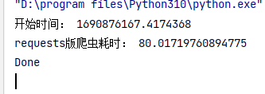
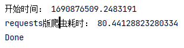
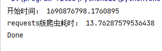
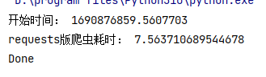

#### 简介

用于下载https://wallhaven.cc/指定页面的图片

挂梯子下载会比较快

#### 主程序

```
fast_download.py（异步更快，会遗漏）
```

#### 待办

- [ ] 下载当前过滤条件下所有页的图片（可选页数）
- [ ] 解决下载遗漏问题

#### 图片寻找

1. 找到所有img标签

2. 获取src内容即封面图片地址

3. 转换为具体图片地址

   https://th.wallhaven.cc/small/o5/o52olp.jpg) 

   https://w.wallhaven.cc/full/o5/wallhaven-o52olp.png) 

   把找到的第一个th替换成w

   把第一个small替换成full

   在最后一个/后面加上wallhaven-

   jpg、png


#### 下载时间对比


十个线程下载十张图片




一个线程下载10张




挂梯子多线程



挂梯子单线程

